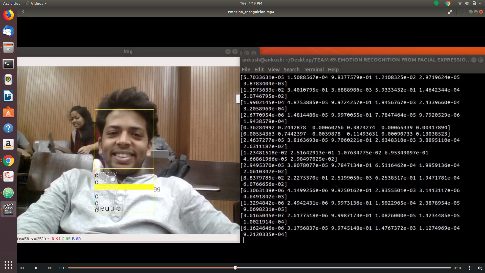
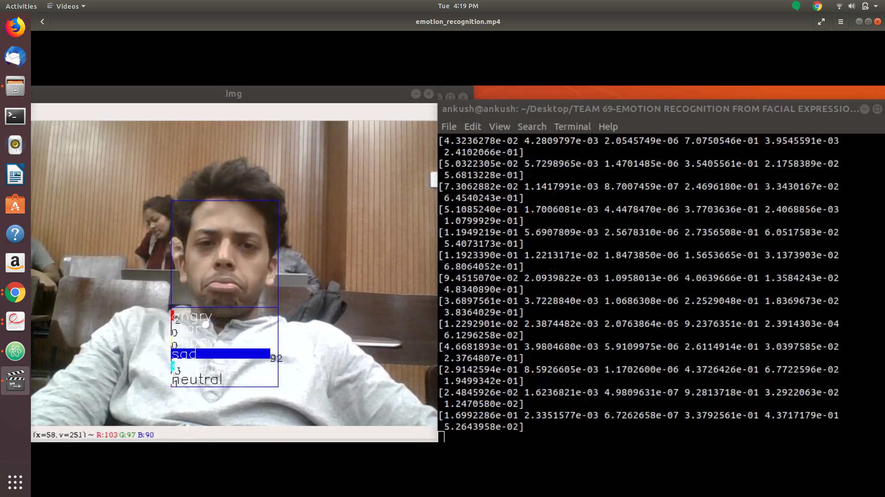
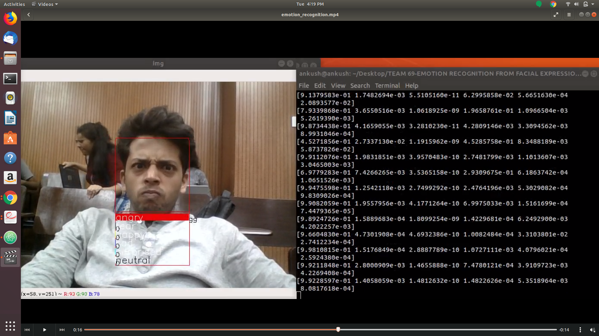
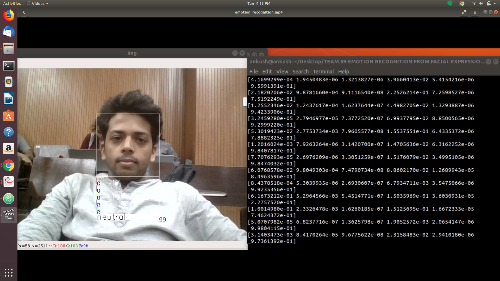
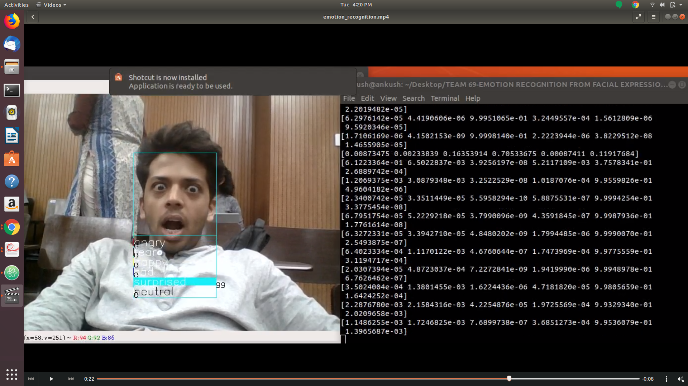

# EMOTION RECOGNITION (AI)
# 1.1 AIM OF THE PROJECT
To recognise the emotions of the human face using CNN algorithm.
* Create an own face dataset or to import an existing dataset from the internet.
* Create a model and train it to increase the accuracy for recognize the facial emotions.
* To use the trained model for emotions recognise in real time
# 1.2 WORKDONE
* Used 3 datasets - FER2013, JAFFE, Own face dataset used to train the model.
* The model has been developed with a maximum accuracy of 80.61%, with the help of python libraries
* The model is then used to recognise the emotions of a human face from the real time data using web camera
# 1.3 DATASETS
1.3.1 Fer2013 : It is a face-set uploaded by kaggle.com that contains 35887 datasets
1.3.2 JAFFE database : This was uploaded by kasrl.org that has 214 datasets
1.3.3 Our own database : We created our own database which has 360 datasets created using Viola-Jones method.
* <a href = "https://drive.google.com/open?id=16C3mmEKyTKXOdVcs_cNSguFz_UqVPGez"> Our own dataset <a>
* <a href = "https://drive.google.com/open?id=1Pgi7IQwyyECD8tOsoPEdBpZOH3IUFELp"> jaffe dataset <a>
* <a href = "https://drive.google.com/open?id=1f73yBxrtpUPL1PRlHz-qMzqsd7v8qVjl"> FER2013 dataset <a>
# 1.4 Emotions recognized
1. Happy
2. Sad
3. Angry
4. Neutral
5. Scared
6. Fear
# 1.5 DIFFICULTIES FACED
* The downloaded databases was extremely biased.
* Not easily accessible datasets.
* Creating our own data was quite difficult.
# 1.6 RESULTS:
* Happy face

* Sad face

* Angry face

* Neutral face

* Surprised face

# watch the complete output here
https://youtu.be/jnS3BogBTtM
# 1.7 REFERENCE
Octavio Arriaga Et Al., “Real-time Convolutional Neural Networks for Emotion and Gender Classification” ,2017.
